## Datendrang

*Datendrang* heißt meine Kolumne mit Datenvisualisierungen in der Zeitschrift [Tagebuch](https://tagebuch.at). In diesem Repository werden laufend die Daten, der R-Code und die fertigen Abbildungen zur Verfügung gestellt.

## #1 Arbeitszeit (TB 5/23)

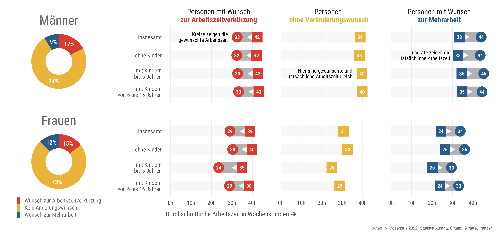

## #2 Inflation (TB 6/23)

## #3 Hitzetage (TB 7-8/23)

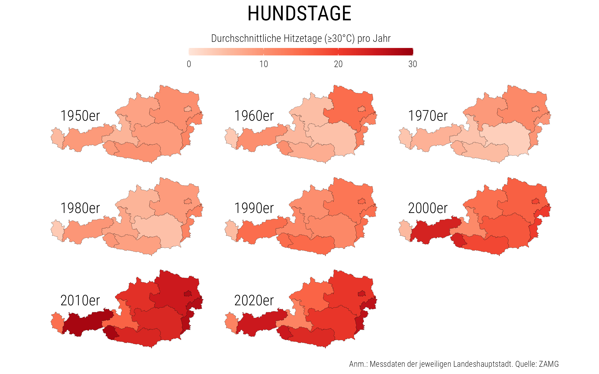

## #4 Bildungspersistenz (TB 9/23)

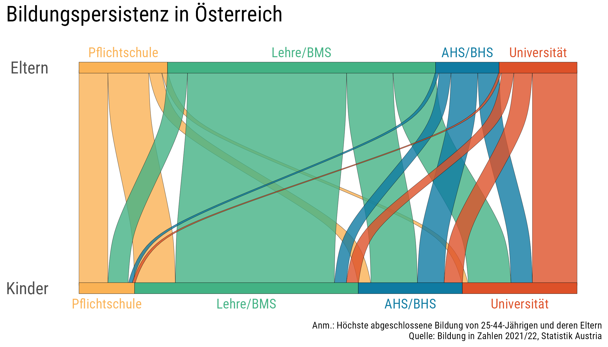

## #5 Vermögen (TB 10/23)

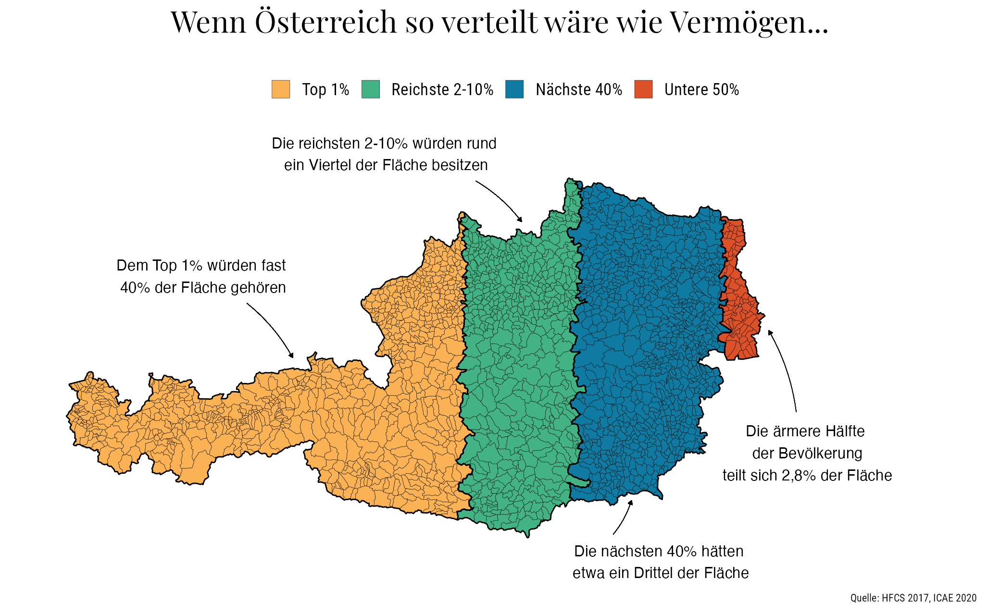

## #6 KV-Abschluss (TB 11/23)

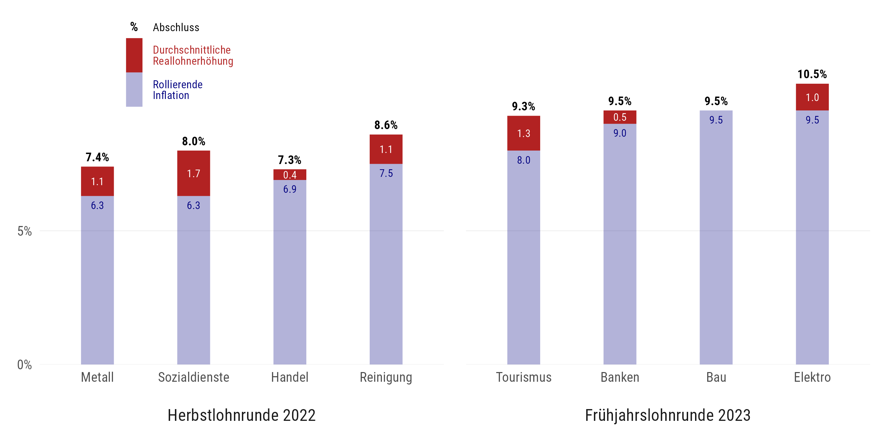

## #7 Energiearmut (TB 12/23)

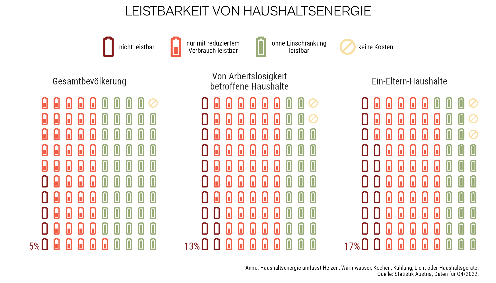

## #8 Unbezahlte Arbeit (TB 2/24)

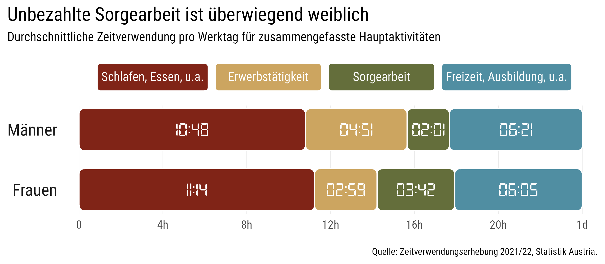

## #9 Rekordgewinne im Bankensektor (TB 3/24)

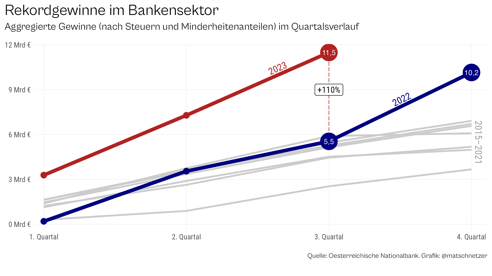

## #10 Steuerflucht in Europa (TB 4/24)

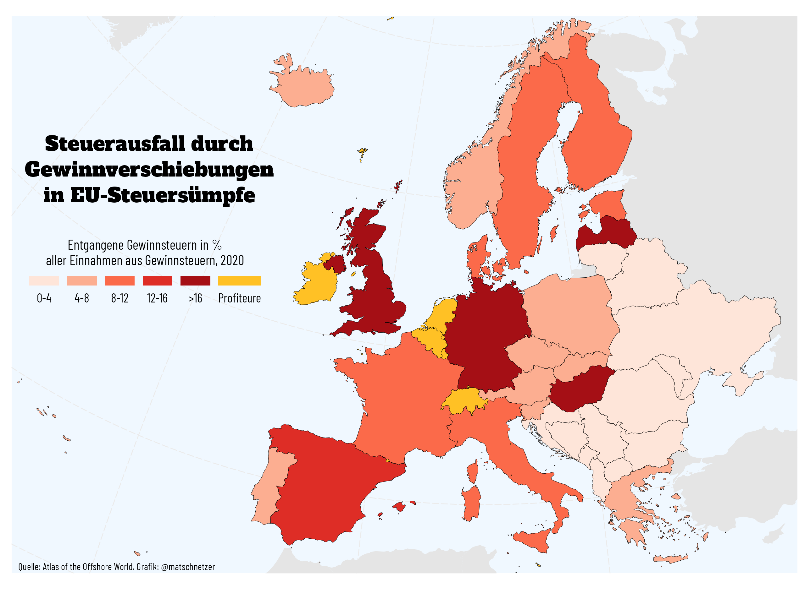

## #11 Erbschaften (TB 5/24)

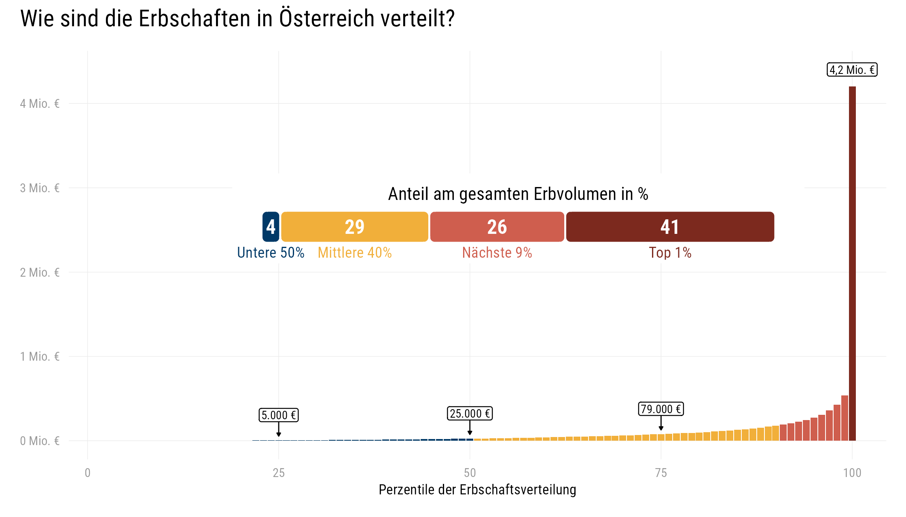

## #12 Wartezeiten auf Arzttermin (TB 6/24)

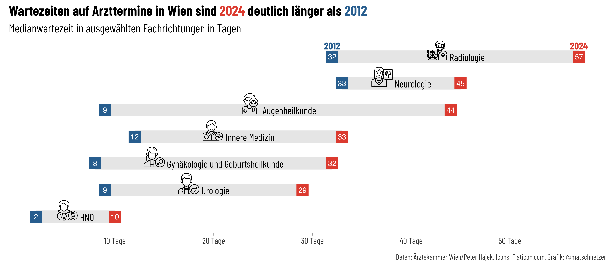

## #13 Nationalratswahl 2024 (TB 1/25)

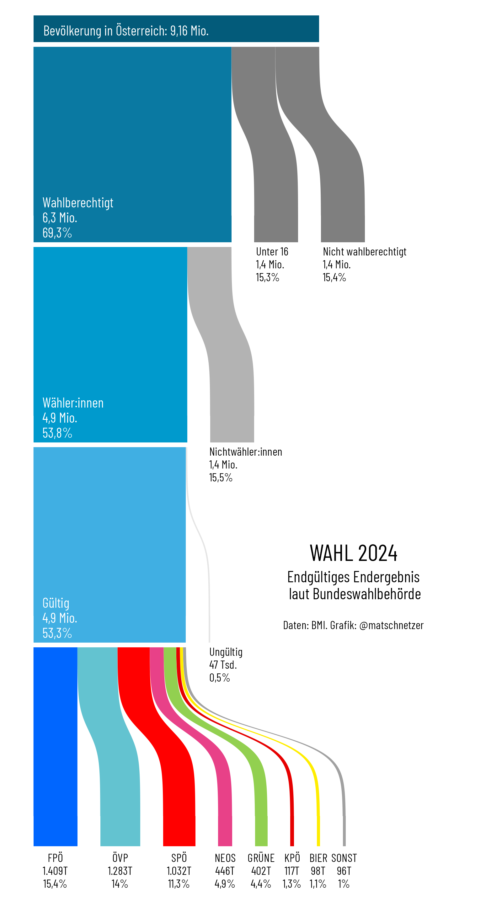

## #14 Energiemix (TB 2/25)

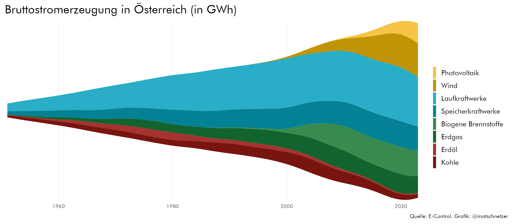

## #15 Exporte (TB 3/25)

## #16 Budget (TB 4/25)

## #17 Prognosefehler (TB 5/25)

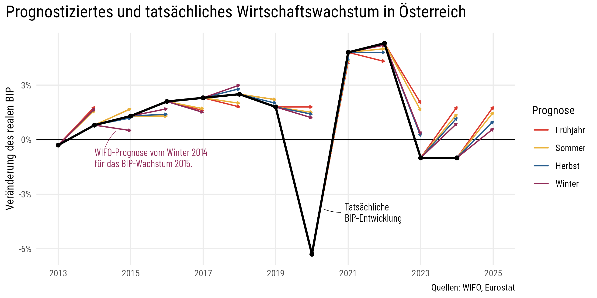

## #18 Teilzeit (TB 6/25)

## #19 Klimaschäden (TB 1/26)

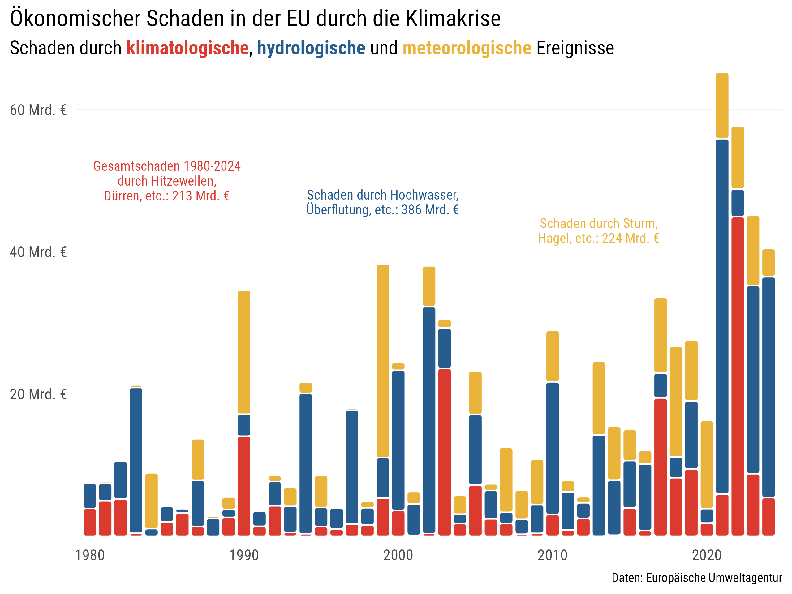

## #20 Gewalterfahrungen von Frauen (TB 2/26)

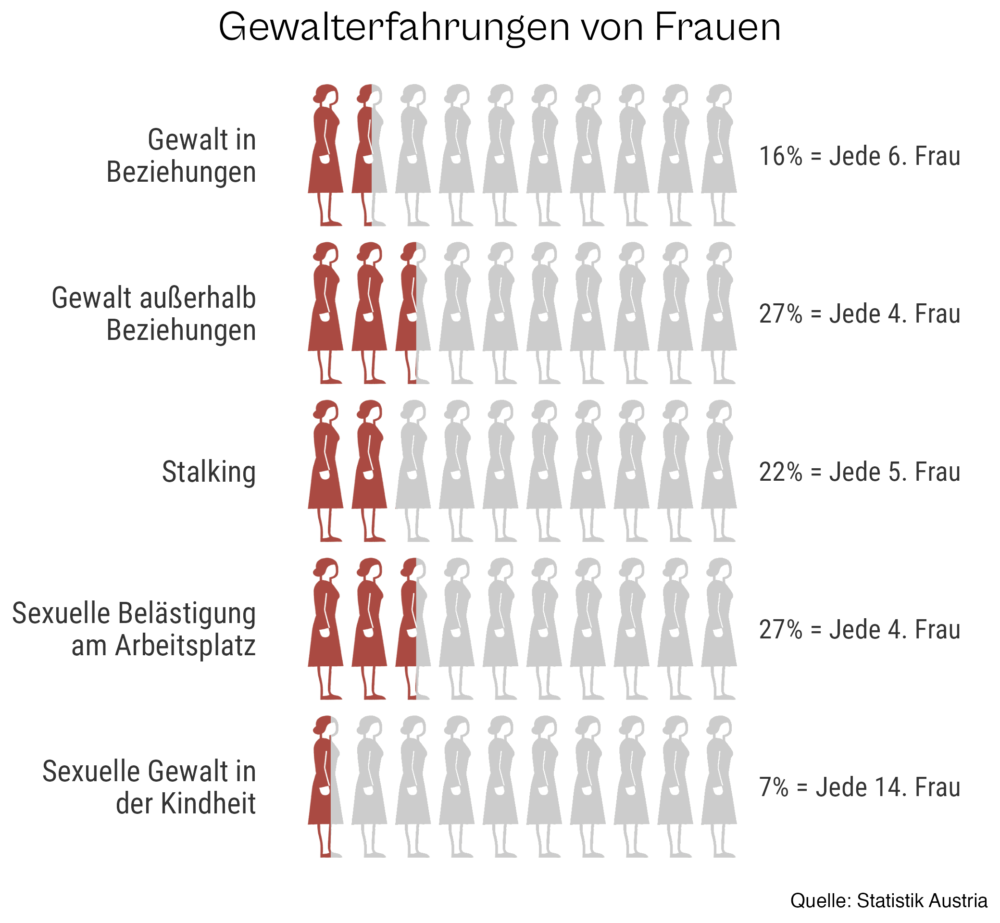