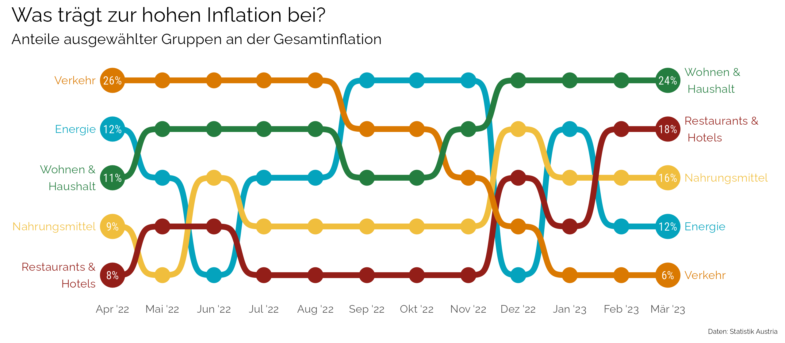
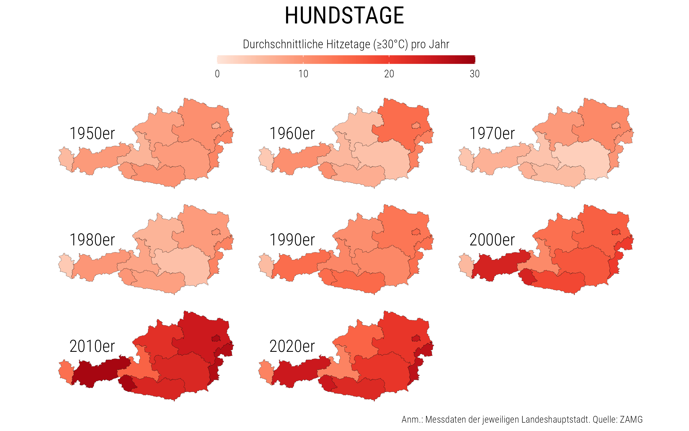

## Datendrang

*Datendrang* heißt meine Kolumne mit Datenvisualisierungen in der Zeitschrift [Tagebuch](https://tagebuch.at). In diesem Repository werden laufend die Daten, der R-Code und die fertigen Abbildungen zur Verfügung gestellt.

## #1 Arbeitszeit (TB 5/23)

## #2 Inflation (TB 6/23)

## #3 Hitzetage (TB 7-8/23)

