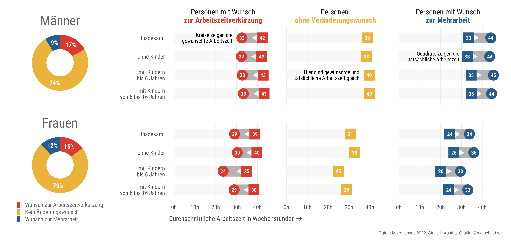
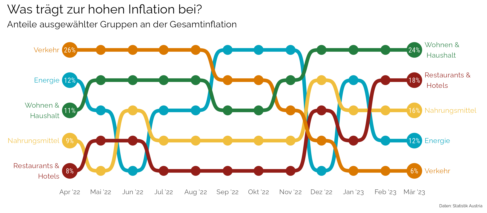
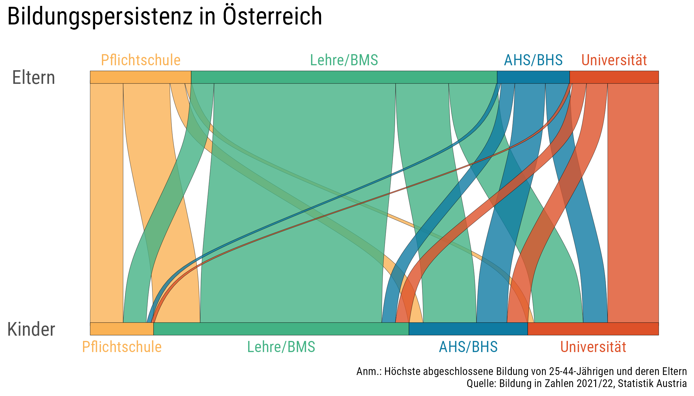
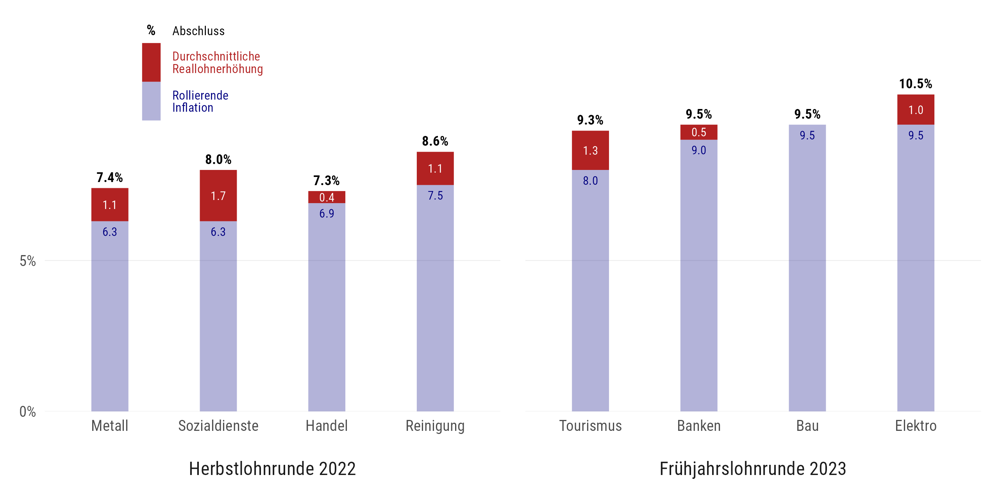
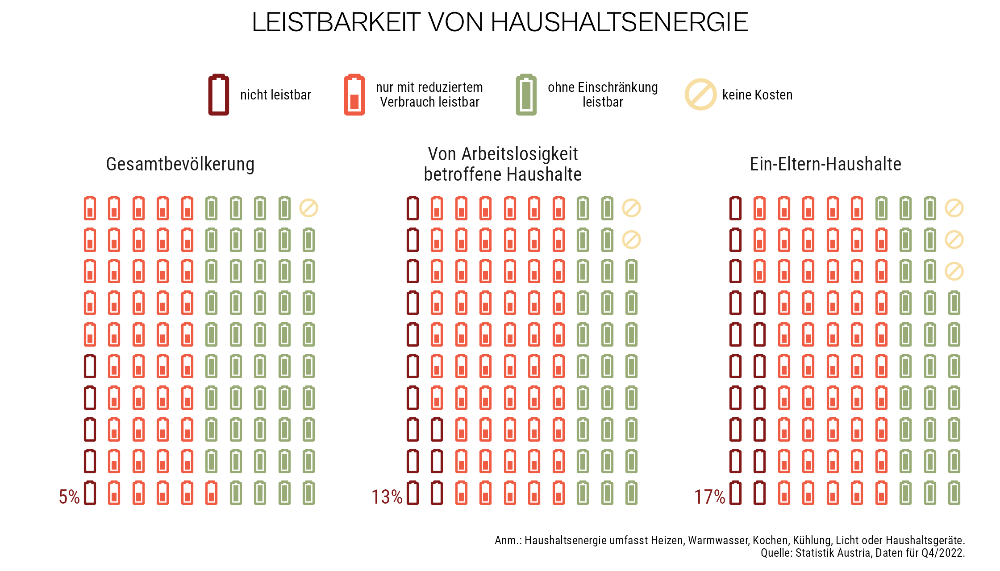
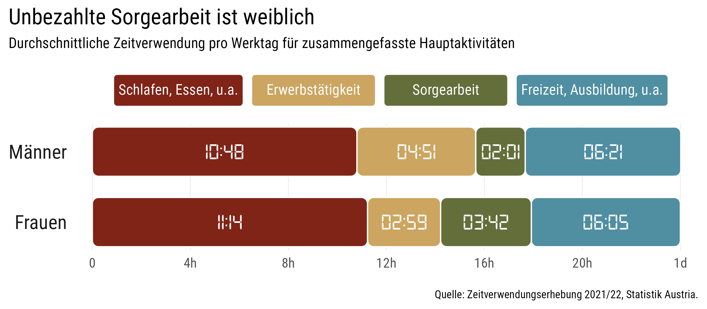
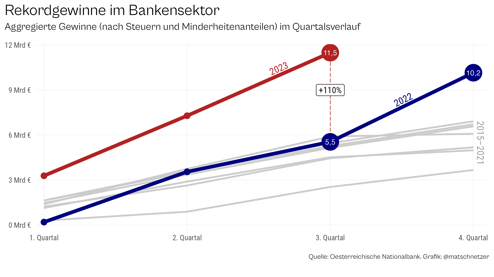
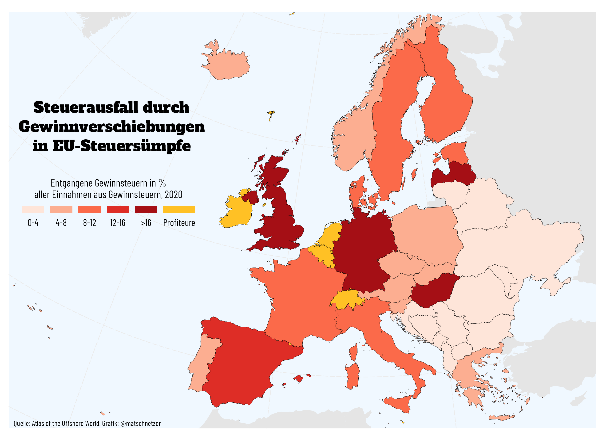

## Datendrang

*Datendrang* heißt meine Kolumne mit Datenvisualisierungen in der Zeitschrift [Tagebuch](https://tagebuch.at). In diesem Repository werden laufend die Daten, der R-Code und die fertigen Abbildungen zur Verfügung gestellt.

## #1 Arbeitszeit (TB 5/23)

## #2 Inflation (TB 6/23)

## #3 Hitzetage (TB 7-8/23)

## #4 Bildungspersistenz (TB 9/23)

## #5 Vermögen (TB 10/23)

## #6 KV-Abschluss (TB 11/23)

## #7 Energiearmut (TB 12/23)

## #8 Unbezahlte Arbeit (TB 2/24)

## #9 Rekordgewinne im Bankensektor (TB 3/24)

## #10 Steuerflucht in Europa (TB 4/24)

